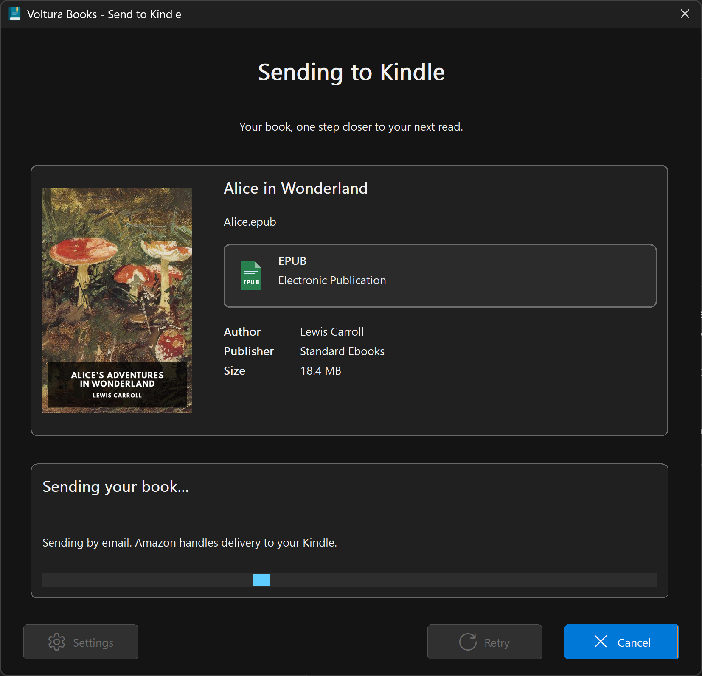

<h1 align="center">Voltura Books</h1>

Your next read. One right-click away.

<a href="https://github.com/voltura/voltura-books/releases">Download for Windows</a> · <a href="https://voltura.github.io/voltura-books/">Website</a> · <a href="https://github.com/voltura/voltura-books/issues">Help & feedback</a>

Send books and documents to your Kindle from Windows Explorer. Select one or more, right-click, and choose
**Send to Kindle**, and get back to reading. Voltura Books is a small native Windows
app with no library to manage and no background service.

*App preview featuring a public-domain edition of Alice’s Adventures in Wonderland.
[Edition and artwork credit](docs/credits.md).*

## Made for one simple job

- **Two easy ways to send.** Right-click your books, or open Voltura Books - Send a book from Start and drop your books into the window.
- **Your choice of sending method.** Use your email provider or send directly without an email password.
- **A familiar Windows interface.** Light and dark themes, with Per-Monitor V2 display scaling.
- **Book details at a glance.** See the cover or preview, filename, readable file size, full format name, and available title, author, publisher, and page count. Missing covers use a full-size placeholder.
- **Fewer accidental duplicates.** Get a reminder before sending the same book to the same Kindle again.
- **Local settings.** Email passwords are stored in Windows Credential Manager. No telemetry.

## Get started

1. Download the **VolturaBooks-Setup-…-win-x64.exe** installer from [Releases](https://github.com/voltura/voltura-books/releases) and run it. Designed and tested for Windows 11 x64. Windows 10 compatibility has not been verified. Windows 8 and 8.1 are not supported.
2. Open **Voltura Books - Settings** and enter your Kindle email and sender email.
3. Choose a sending method and save. If you use your email provider, enter its email password or the app password described in the form.
4. Add your sender email to Amazon's **Approved Personal Document E-mail List** in [Content and Devices](https://www.amazon.com/hz/mycd/myx).
5. Right-click an `.epub` → **Show more options** → **Send to Kindle**. If Windows already shows the classic menu, choose **Send to Kindle** directly.

Find your Kindle email in Amazon's Content and Devices settings. Your sender email
is the address the book comes from; your Kindle email is where it goes.

Installation is for your Windows account and does not change your default EPUB reader.
Open **Voltura Books - Send a book** from Start to drag and drop one or more books, or select **Choose files…**.
Open **Voltura Books - Browse books** from Start (or run `VolturaBooks.exe --browse`) to go straight to browsing and reading. **Send book(s)** uses the same sending flow. **Close** exits browsing without opening the sending window or sending anything, including when browsing was opened from **Browse folder…**. Use `--browse --test-sending` to open directly with simulated sending enabled.
Browsing tries the previous folder, Downloads, then Documents. If none can be read, it opens the folder picker first; cancelling exits without sending anything.
To try the app without sending anything, select **Don’t send emails** in the Send a book window. **Test sending** simulates sending, needs no email setup, and leaves sent-book history unchanged. It resets when you close the app.

You can also start with this option checked by running `VolturaBooks.exe --test-sending`
(formerly `--preview`). In Browse books, the action is **Test sending** for one
selected file or **Test sending 3 books** for three selected files. Reading and
fullscreen previews do not send emails, regardless of this checkbox.

Choose **Browse folder…** to explore supported files, preview covers and details, and select one or several to send. Use the refresh icon or **F5** to reload files added, removed, or changed while browsing. Search by filename, sort by name or modified date, and see a larger preview beside the book details, including Created and Modified dates from file properties. You can also open a file in its usual app, show its folder, or copy its path. Switch between the file list and cover thumbnails. **All types** shows everything; choose one or more type buttons to narrow the list. Only types present in the folder appear, with pictures grouped under **Images**. Hold Ctrl or Shift to select several files.
All routes open the same sending window with the cover and duplicate reminder.

To read a PDF or EPUB in **Browse books**, hover near the preview's right edge and
choose the next-page arrow. PDFs continue from the first-page preview; EPUBs open
in reading order with their packaged styling and images. Hover the left or right
edge to turn pages, or use the Left/Right keys while the reader has focus.
A single-page, image-only EPUB opening that repeats the displayed cover resource
is skipped; distinct or ambiguous opening sections are kept.
The fullscreen control appears near the top-right on the cover and while reading.
The details panel also has a **Read in full screen** button. **F11** toggles
fullscreen and **Esc** returns to Browse books without closing it. Your current
location is retained when changing view size, but is not saved between books.
Image previews (JPEG, PNG, GIF, and BMP) also support fullscreen through the
**View in full screen** button, the corner icon, or **F11**, without page arrows.
TXT files open in a native read-only, word-wrapped reader. Scroll normally or use
the edge arrows to move by a screenful; left at the beginning returns to the cover.
UTF-8, BOM-marked UTF-16, and Windows-1252 text are supported. Text is loaded in
small chunks as you read; there is no fixed 8 MB reading cutoff.
RTF, HTML, HTM, DOC, and DOCX files also support reading and full screen. RTF preserves
supported text formatting and embedded pictures. HTML displays inline styles and
embedded images, without loading companion files or network resources.
DOCX reading shows supported text formatting, tables, embedded images, headers,
footers, and notes without requiring Word or LibreOffice. Scroll normally or use
previous/next to move by a screenful. Explicit page breaks are preserved, but
layout and pagination can differ from Word and Kindle. Word 97–2003 DOC files
convert locally to temporary DOCX when reading starts, using the same formatted
reader. Supported formatting, tables, and embedded pictures are preserved.
The original document is sent unchanged and used by **Open with default app**.
DOC conversion requires .NET Framework 4.8 (included with Windows 11), not Office.
Encrypted, damaged, and pre-97 DOC files cannot be converted; open the original
in its default app. Conversion is limited to 30 seconds and 128 MiB of output.
A centered spinner and status text appear immediately when opening a document.
Page changes and view preparation show feedback after 150 ms if still busy.
Fullscreen can still be exited while loading, and enlarging a cover does not
start reading.
Reader content loads when you open it and is released when you change books.
Formatted readers run with a memory budget based on available system resources.
If formatted reading is unavailable, choose **Read as text** or **Open with default app**.
Text-only fallback drops formatting and images and uses temporary disk storage,
which is removed when the document closes.

EPUB, HTML, DOC, and DOCX reading use Microsoft Edge WebView2 Runtime, normally included in Windows 11.
If it is unavailable, HTML and DOCX (including successfully converted DOC) offer **Read as text**; you can also use
**Open with default app**. Book scripts, external links,
and remote resources are blocked; DRM, encrypted/obfuscated EPUB resources and
password-protected PDFs and encrypted DOC/DOCX documents are not supported.
Open **Voltura Books - Settings** whenever you want to change your setup.

## Choose how to send

| Method | What you enter | What to know |
| --- | --- | --- |
| **Send through my email provider** | Kindle email, sender email, and email/app password | The app looks up your server settings. Connections require verified TLS. Advanced settings allow manual server configuration. |
| **Send directly (no password)** | Kindle email and sender email | Connects to the recipient's mail server on port 25. Some networks and receiving servers block this. Uses verified TLS when available, but may send unencrypted. |

For Gmail, Yahoo, or iCloud, the form explains the provider's app-password requirement
and links to its instructions. Availability depends on your account. Browser-based
sign-in (OAuth) and separate SMTP usernames are not supported.

If direct sending fails, open Settings and choose your email provider. Voltura Books
does not automatically retry or switch sending methods.

## Sending and delivery

- Select one or several supported files. Books send sequentially, one email per book, up to **50 MB** (50,000,000 bytes). Your provider may have a smaller limit, including email encoding overhead.
- Files are attached as-is. Voltura Books does not convert files or remove DRM. Amazon handles conversion and Kindle delivery.
- **“Email sent” means the mail server accepted the email.** Kindle delivery can take a few minutes; Amazon may reject a document afterward.
- For several books, the current cover and “Sending book 1 of 5…” show progress. A single book keeps the simple “Sending your book…” message.
- On a failure, sending pauses for Retry, Skip, or Cancel. Cancellation stops the current attempt and leaves remaining books unsent. A summary reports sent, skipped, unconfirmed, and unstarted books.
- Previously sent books can be sent again or skipped; Cancel stops the remaining queue.
- Opening Voltura Books again brings the current window forward. If you open more files during a send, you can add them after the current books.
- `--browse --test-sending` preserves simulated sending when forwarded to the open sending launcher. If a browser or sending flow is already open in a different mode, close it before switching modes.
- If a connection ends with an uncertain result, check your Kindle before retrying.
- Duplicate reminders use the book's contents and destination, so renaming the file does not bypass the reminder. Only accepted submissions are recorded.
- EPUB covers come from the book itself. PDFs show the first page, images show the picture, and DOCX uses an embedded thumbnail if present. Other documents and files without a preview show a full-size placeholder cover.

Available metadata is read locally in the background and does not gate sending. EPUBs
usually have no fixed page count. PDF page counts are read from the document; DOCX
page counts are stored values that may be outdated. Other metadata depends on what
the file or Windows provides. Missing fields are omitted.

## Supported files

EPUB, PDF, RTF, TXT, HTML/HTM, DOC/DOCX, JPEG/JPG, PNG, GIF, and BMP.
AZW, AZW3, and MOBI are not supported by this email delivery route. Use a supported
edition; renaming the extension is not conversion. Each file is sent unchanged,
without fetching linked HTML resources or removing document protection.

See [Amazon’s supported formats](https://digprjsurvey.amazon.co.uk/csad/help/node/TCUBEdEkbIhK07ysFu)
and the [file-type legend](https://voltura.github.io/voltura-books/#questions).

## Privacy and removal

Settings and sent-book history stay in `%LOCALAPPDATA%\Voltura Books`. History contains
the filename, destination email, submission time, and a file-content hash. Passwords
are stored separately in Windows Credential Manager.

Automatic provider lookup sends your email **domain**, not your full email address
or password, to Thunderbird's public configuration service. It may also use DNS to
identify the hosting provider. Sending contacts your chosen provider or the recipient's
mail server. There is no Voltura account, telemetry, or automatic updater.

Remove the app through **Windows Settings → Apps → Installed apps → Voltura Books →
Uninstall**. Removal also deletes its saved settings, password, and sent history.

## Build from source

See [BUILDING.md](BUILDING.md) for prerequisites, build commands, packaging, and tests.

## License

[MIT](LICENSE) · Copyright © 2026 Voltura AB.

The application uses libcurl and miniz under their respective licenses. Their notices
are included with the installer. Kindle is a trademark of Amazon.com, Inc. or its
affiliates. Voltura Books is an independent application and is not affiliated with
or endorsed by Amazon.

## About and updates

Open **About** from the Send a book window for version, license, website and support links. **Check for updates** downloads a newer stable release and verifies it before offering **Install update**. You choose when to install. Checks contact GitHub only when requested.
